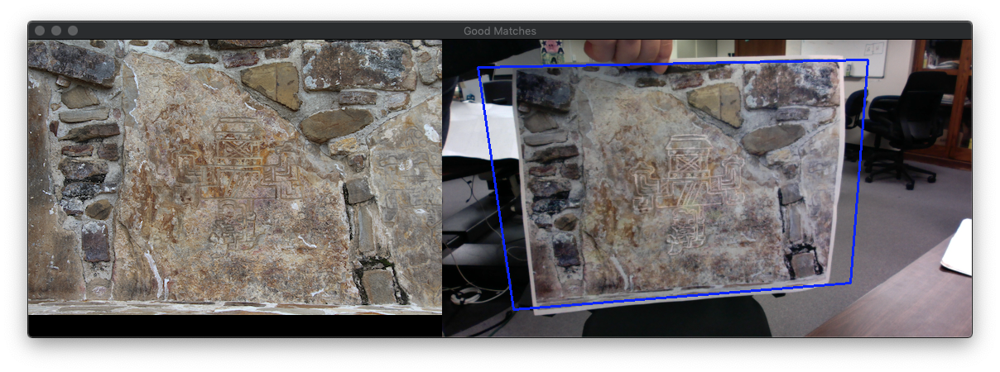
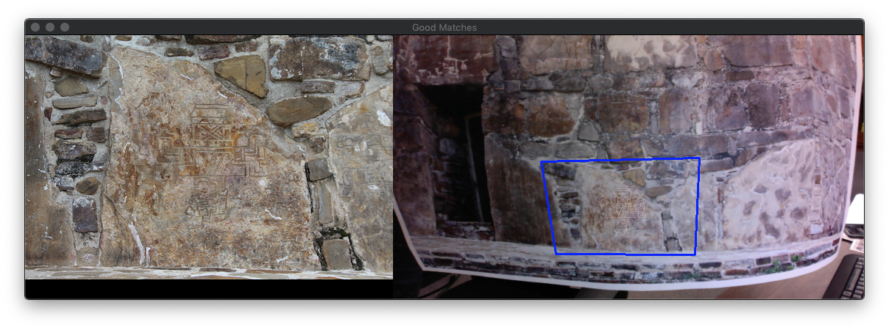

# OpenCV Starter Kit

_A simple script to install/build OpenCV from source on macOS, and example code in C++/Python to perform image recognition_

Note: although the build script is macOS-oriented, the example programs should work on any OS!

## Requirements

* macOS (tested on macOS Mojave, 10.14.6)
* Command line C/C++ compiler(s), e.g. GCC or Clang (if you have XCode installed, you're already good to go)
* Admin rights on your Mac (to build/install OpenCV)
* A webcam (if you're using the example programs with a webcam stream)

The scripts assume the default macOS command line setup (Terminal.app with bash), but should be portable with fairly minimal changes.

## Introduction

Installing [OpenCV](https://opencv.org/) (and [`opencv_contrib`](https://github.com/opencv/opencv_contrib)) through package managers is usually pretty straightforward, but sometimes you want to build from source. This can be tricky on macOS; although Google can lead you to instructions on the web, they are often outdated or simply don't work.

Therefore: I wrote this little script, along with a couple of example programs (in C++ and Python) to test your OpenCV build worked.

The build script will attempt to download and compile the minimal OpenCV libraries and set up some [virtual Python environments](https://virtualenvwrapper.readthedocs.io/en/latest/) (with Python3) to make OpenCV development more pleasant. The [Homebrew](https://brew.sh/) package manager will also be installed to handle some important dependencies.

## Important note about security

Apple tightened up security in macOS with the release of El Capitan, and placed additional protections on some files and directories in e.g. `/usr/`. This can prevent Homebrew running post-install scripts; in particular, [pip](https://pip.pypa.io/en/stable/) may not be available after installing Python3, despite `pip3` being a standard Python3 component. __As `pip3` is used by the build script, explicit ownership of `/usr/local/` is granted to the current user to ensure `pip3` is available after Python3 is installed__. Another approach is to install `pip3` using python itself; this is specified in the build script by changing the `pip_install_option` variable (see the script itself for more details).

Increased security also requires macOS to prompt the user for permission the first time a program tries to access the system webcam. If the example C++ program cannot open the webcam at runtime, access to the webcam may not have been granted to command-line programs. If you're having problems of this nature, try running the example Python script - it seems to trigger an access prompt even when the C++ example does not. After you allow the access request, the C++ example (and indeed, all other command-line programs) should be able to access the webcam. __You can disable webcam access through `System Preferences -> Security & Privacy -> Privacy -> Camera`__.

## OpenCV build instructions

Simply copy the `build_opencv_macos.sh` script to wherever you'd like the OpenCV source code directories to be (I typically put them in `~/Desktop`).

Next, take a quick look at the script; you should see a set of options at the start of the file, including an `OpenCV_version` variable to specify which version of OpenCV you'd like to install (default: `4.1.1`). There follows a `main` function that calls the various parts of the preparation and installation process.

If everything looks acceptable, run the script in the directory you'd like the OpenCV source code to be placed:

	john$ ./build_opencv_macos.sh

... and prepare to enter some basic confirmations and the admin password when prompted. The whole process (get support tools, download OpenCV source, configure, build, and install) should take around 15 minutes.

After the script finishes, you should have a directory containing the source code of the core OpenCV libraries and extra modules, with build results inside `build/` in the main OpenCV source directory. My final directory structure looks like this:

	OpenCV-4.1.1/
	|-- opencv-4.1.1.zip
	|-- opencv-4.1.1/
	|   |-- build/
	|   |-- ... etc ...
	|-- opencv_contrib-4.1.1.zip
	|-- opencv_contrib-4.1.1/
	|   |-- ... etc ...

There will also be some additions to the `/usr/local/` directory.

The build script adds a few environment variables to the specified shell profile (default: `~/.bash_profile`), and so to try the example programs immediately you can either `source ~/.bash_profile` or open a new Terminal window (as the newly opened shell will automatically parse `~/.bash_profile`).

## Example programs

Included in this repository are two example programs (C++ and Python) with essentially identical functionality:

1. Read an image file of interest, and then ...
2. Attempt to identify that image in either: a) another image file, or b) live video from the webcam.

__Please see the note about webcam access for command-line programs in the section `Important note about security`!__

On the assumption OpenCV built and installed successfully, we may launch the Python example program in the virtual Python environment `cv` that was set up by the build script:

	john$ workon cv
	(cv) john$ python Example.py

If all is well, we should see some user guidelines printed:

	Usage : Example.py find=path [in=path] [using=x] [superpose=x] [min=N] [every=N]

	Where:

	  find  : path to image to detect
	  in    : OPTIONAL path to image in which to search (default: 'webcam', i.e. use webcam feed)
	  using : OPTIONAL algorithm to use, one of 'SURF', 'SIFT', or 'ORB' (default: SIFT)
	  superpose : OPTIONAL path to image to superpose onto matched region
	  min   : OPTIONAL minimum N matching features before bounding box drawn (default: 4)
	  every : OPTIONAL run processing every N frames (default: 1)

	Notes:

	The SURF and ORB algorithms can be accompanied with algorithm-specific data;
	  - for SURF, this is the Hessian tolerance e.g. 'using=SURF:400' (default value: 400')
	  - for ORB, this is the number of features e.g. 'using=ORB:500' (default value: 500')

	The 'in' parameter can be decorated with a scale value for the data, e.g.: in=webcam:0.5,
	in=mypic.png:1.5. The default scale value is 1.0 (i.e., no scaling will be performed).

To compile the C++ example, we need to specify the location of our OpenCV headers and which OpenCV libraries we'll be using, e.g.:

	john$ g++ -I/usr/local/include/opencv4 -lopencv_core -lopencv_highgui -lopencv_imgproc -lopencv_imgcodecs -lopencv_videoio -lopencv_calib3d -lopencv_features2d -lopencv_xfeatures2d -std=c++11 -Wall -Wextra -pedantic -O2 Example.cpp

We don't need to use our Python virtual environment (via `workon cv`) to compile and run the C++ example. Running the resultant `a.out` file with no parameters should give you the same user guide as the Python script.

An example screenshot of the running program is shown below. In this example, we attempt to recognize an image of a specific region of a wall from the [Monte Alban](https://montealban.oucreate.com/) archaeological site (all images curtesy of [Dr. Marc Levine](https://samnoblemuseum.ou.edu/staff/marc-levine/)).

The image passed using the `find` parameter is shown on the left, the current webcam feed is shown on the right, and any recognized region is outlined in blue. Futhermore, we have used the `superpose` parameter to pass in an enhanced trace of the inscription present on the large stone; this trace is thus highlighted in white on top of the printout of the image.

Running the program again, this time using a printout of a larger region of the wall, we again observe that the specific region of interest is correctly identified in the webcam feed (see below).

Example output from the program may look like this:

	(cv) john$ python Example.py find=../Levine/find.500.png using=orb:2000 min=10
	Parameters:
	  find : ../Levine/find.500.png
	  in : webcam
	  using : orb 2000
	  superpose : 
	  min : 10
	  every : 1
	 12.3 fps : detect 14 ms : knn 15 ms : homography 0 ms : draw 3.3 ms : resize 0 ms : 0 good matches in 1280x720 frame (potential 31.0253 fps)
	 11.9 fps : detect 14 ms : knn 15 ms : homography 0 ms : draw 3.4 ms : resize 0 ms : 1 good matches in 1280x720 frame (potential 31.5581 fps)
	 11.1 fps : detect 14 ms : knn 15 ms : homography 0 ms : draw 3.3 ms : resize 0 ms : 0 good matches in 1280x720 frame (potential 30.9432 fps)
	 11.7 fps : detect 14 ms : knn 15 ms : homography 0 ms : draw 3.3 ms : resize 0 ms : 1 good matches in 1280x720 frame (potential 31.3589 fps)
	 10.8 fps : detect 14 ms : knn 15 ms : homography 0 ms : draw 3.3 ms : resize 0 ms : 1 good matches in 1280x720 frame (potential 30.997 fps)
	 10.7 fps : detect 14 ms : knn 15 ms : homography 0 ms : draw 3.5 ms : resize 0 ms : 3 good matches in 1280x720 frame (potential 30.8431 fps)
	 12.2 fps : detect 14 ms : knn 15 ms : homography 0.72 ms : draw 4.4 ms : resize 0 ms : 76 good matches in 1280x720 frame (potential 29.2887 fps)
	|    +1.44    +0.11  +426.33 |
	|    +0.13    +1.34  +123.78 |
	|    +0.00    +0.00    +1.00 |
	 11.0 fps : detect 15 ms : knn 15 ms : homography 0.63 ms : draw 5.5 ms : resize 0 ms : 76 good matches in 1280x720 frame (potential 27.7072 fps)
	|    +1.36    +0.21  +442.00 |
	|    +0.06    +1.34  +136.74 |
	|    +0.00    +0.00    +1.00 |
	 10.8 fps : detect 15 ms : knn 15 ms : homography 0.55 ms : draw 5.6 ms : resize 0 ms : 79 good matches in 1280x720 frame (potential 27.2558 fps)
	|    +1.33    +0.17  +449.19 |
	|    +0.06    +1.31  +134.43 |
	|    +0.00    +0.00    +1.00 |
	 10.8 fps : detect 15 ms : knn 15 ms : homography 0.53 ms : draw 5.9 ms : resize 0 ms : 93 good matches in 1280x720 frame (potential 27.5384 fps)
	|    +1.33    +0.20  +445.14 |
	|    +0.06    +1.33  +134.75 |
	|    +0.00    +0.00    +1.00 |
	 10.1 fps : detect 15 ms : knn 15 ms : homography 0.53 ms : draw 6 ms : resize 0 ms : 91 good matches in 1280x720 frame (potential 27.5118 fps)
	|    +1.29    +0.17  +451.09 |
	|    +0.05    +1.30  +133.50 |
	|    +0.00    +0.00    +1.00 |
	 10.1 fps : detect 15 ms : knn 15 ms : homography 0.55 ms : draw 5.8 ms : resize 0 ms : 90 good matches in 1280x720 frame (potential 27.5087 fps)
	|    +1.33    +0.22  +446.20 |
	|    +0.06    +1.33  +131.32 |
	|    +0.00    +0.00    +1.00 |
	 11.4 fps : detect 15 ms : knn 15 ms : homography 0.55 ms : draw 5.9 ms : resize 0 ms : 92 good matches in 1280x720 frame (potential 27.5139 fps)
	|    +1.29    +0.17  +452.07 |
	|    +0.05    +1.29  +133.70 |
	|    +0.00    +0.00    +1.00 |
	 11.3 fps : detect 15 ms : knn 15 ms : homography 0.56 ms : draw 4.4 ms : resize 0 ms : 2 good matches in 1280x720 frame (potential 28.8973 fps)
	 12.4 fps : detect 14 ms : knn 15 ms : homography 0 ms : draw 3.5 ms : resize 0 ms : 0 good matches in 1280x720 frame (potential 31.0656 fps)
	 12.7 fps : detect 14 ms : knn 15 ms : homography 0 ms : draw 3.3 ms : resize 0 ms : 5 good matches in 1280x720 frame (potential 30.938 fps)
	 10.8 fps : detect 14 ms : knn 15 ms : homography 0 ms : draw 3.4 ms : resize 0 ms : 2 good matches in 1280x720 frame (potential 30.5629 fps)

In the output above, the jump in `good matches` (and the listing of homography matrices) occurs when a printout of the `find` image is held up in front of the webcam.

## Notes

* The ORB feature detector does not perform well with OpenCV's default number of features (400). I find boosting the ORB feature count gives far better results in most cases (e.g., `with=orb:2000`)